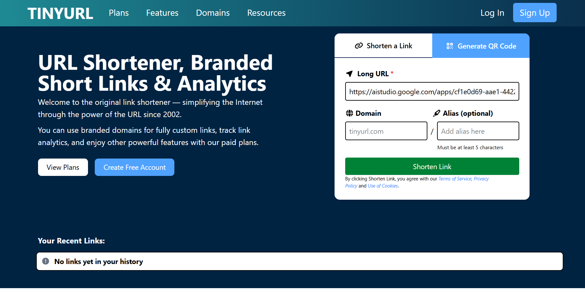
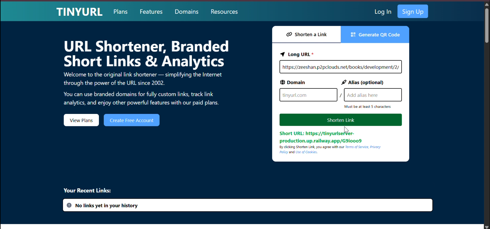

# 🔗 URL Shortener

A modern MERN Stack URL Shortener that allows users to convert long URLs into short, shareable links with a clean and responsive user interface.

## 🚀 Live Demo

🌐 https://tinyurl-jade-eight.vercel.app/

## 📂 GitHub Repository

🔗 https://github.com/usman684/tinyurl

---

# 📌 Project Overview

The URL Shortener is a full-stack web application built using the MERN Stack. It enables users to shorten long URLs into compact links that are easier to share and manage.

This project demonstrates my ability to develop scalable full-stack applications with authentication, database integration, and responsive UI.

---

# ✨ Features

- 🔗 Shorten Long URLs
- 🔐 User Authentication
- 📋 Copy Short URL with One Click
- 📱 Fully Responsive Design
- ⚡ Fast URL Generation
- 🎨 Clean & Modern User Interface
- 🗂 Store URLs in MongoDB
- 🚀 High Performance

---

# 🛠 Tech Stack

### Frontend

- React.js
- CSS3
- Axios
- React Router DOM

### Backend

- Node.js
- Express.js

### Database

- MongoDB
- Mongoose

### Authentication

- JWT (JSON Web Token)
- Bcrypt.js

### Deployment

- Vercel
- Railway / Render

---

# 📷 Screenshots

### 🏠 Home Page



---

### 🔗 URL Shortener Dashboard



---

# 📦 Installation

Clone the repository

```bash
git clone https://github.com/usman684/tinyurl.git
```

Go to project folder

```bash
cd tinyurl
```

Install dependencies

```bash
npm install
```

Run the development server

```bash
npm run dev
```

---

# 📁 Folder Structure

```text
tinyurl/
│
├── screenshot/
│
├── client/
│
├── server/
│
├── public/
│
├── src/
│
└── package.json
```

---

# 🎯 Future Improvements

- 📊 URL Analytics
- 📈 Click Counter
- 📅 URL Expiration
- 🎨 Custom Short URLs
- 📱 QR Code Generation
- 📂 User Dashboard
- ⭐ Favorite URLs
- 🔍 Search & Filter URLs

---

# 👨‍💻 Author

**Muhammad Usman**

📧 Email: usman.rauf.953@gmail.com

🌐 Portfolio  
https://portfoliosite-zeta-sandy.vercel.app/

💻 GitHub  
https://github.com/usman684

🔗 LinkedIn  
https://www.linkedin.com/in/muhammad-usman-2041b3396/

---

# ⭐ Support

If you found this project useful, please consider giving it a ⭐ on GitHub.

Your support motivates me to build more high-quality open-source projects.
